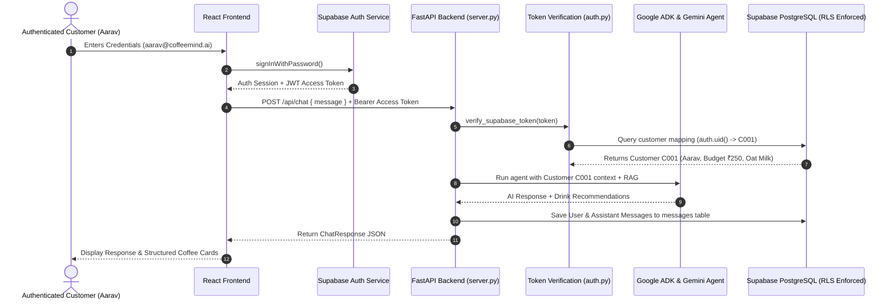

# Supabase Authentication & Persistent Customer Data Architecture

This document describes the architectural design, database schema, security policies, token verification flow, and setup instructions for Supabase integration in **CoffeeMind AI**.

---

## 1. Overview & Goals

CoffeeMind AI uses **Supabase** for secure user authentication and persistent database storage without disturbing the core AI layer:

- **Authentication**: Email/Password Sign-Up, Sign-In, **Google OAuth ("Continue with Google")**, Session Persistence, and Sign-Out.
- **Database Persistence**: Customer profiles, preferences, conversation sessions, and message history.
- **Strict Row-Level Security (RLS)**: Enforced at the PostgreSQL level so User A cannot read, modify, or inspect User B's conversations or personal data.
- **Customer ID Mapping Architecture**: Supabase `auth.users.id` (UUID) maps to an internal customer record (`customer_id` e.g. `C001`, `C002`) on the backend.
- **Privacy & Security**: Internal customer IDs, Google Client Secrets, and Supabase Service Role keys are **never** exposed to the React frontend or requested from users.

---

## 2. Architecture & Data Flow



---

## 3. Customer ID Mapping & Security

### Why Internal Customer IDs are Kept Private
In the legacy local file mode, customer profiles were identified by simple strings like `C001` (Aarav) and `C002` (Priya). Exposing `C001` to the frontend or trusting client-provided customer IDs is a security vulnerability (IDOR - Insecure Direct Object Reference).

### Server-Side Resolution Flow
1. **Frontend**: Stores only the Supabase JWT token and sends it in the HTTP request header:
   ```http
   Authorization: Bearer <supabase_jwt_access_token>
   ```
2. **FastAPI Backend (`coffee_agent/auth.py`)**:
   - Validates the token's signature, issuer, and expiration.
   - Extracts the authenticated `sub` (Supabase `auth_user_id`).
   - Resolves the internal `customer_id` (`C001`) from the `customers` database table.
   - Formats the customer prompt prefix for Google ADK (`[Customer profile C001: Aarav]`).
3. **Database RLS**: Every SQL query executed against Supabase uses the authenticated user's `auth.uid()`, guaranteeing hardware-level isolation.

---

## 4. PostgreSQL Schema & Row Level Security (RLS)

The complete SQL schema and RLS policies are maintained in [`scripts/supabase_schema.sql`](file:///e:/Hack2Skill/Coffee%20Shop%20RAG/scripts/supabase_schema.sql).

### Key Tables
1. `customers`: Maps `auth_user_id` (UUID FK to `auth.users`) to `customer_id` (VARCHAR `C001`).
2. `customer_preferences`: Dietary preferences, preferred temperature, milk choice, and budget limit.
3. `conversations`: Conversation sessions owned by a specific customer.
4. `messages`: Individual chat messages in a conversation session.

### RLS Policies Summary
- `customers`: Users can `SELECT` and `UPDATE` only their own row (`WHERE auth_user_id = auth.uid()`).
- `customer_preferences`: Users can access preferences linked to their customer record.
- `conversations`: Users can `SELECT`, `INSERT`, `UPDATE`, `DELETE` conversations where `customer_id` belongs to them.
- `messages`: Users can access messages only if they own the parent conversation session.

---

## 5. Migration & Setup Instructions

### Step 1: Run SQL Schema in Supabase
1. Open the [Supabase Dashboard](https://app.supabase.com).
2. Navigate to the **SQL Editor**.
3. Copy the contents of [`scripts/supabase_schema.sql`](file:///e:/Hack2Skill/Coffee%20Shop%20RAG/scripts/supabase_schema.sql) and execute the query.

### Step 2: Environment Configuration
Create/update `.env` in the root directory:
```env
SUPABASE_URL=https://<your-supabase-project-id>.supabase.co
SUPABASE_KEY=<your-supabase-anon-key>
SUPABASE_SERVICE_ROLE_KEY=<your-supabase-service-role-key>
GEMINI_API_KEY=<your-gemini-api-key>
```

Create/update `frontend/.env`:
```env
VITE_SUPABASE_URL=https://<your-supabase-project-id>.supabase.co
VITE_SUPABASE_ANON_KEY=<your-supabase-anon-key>
```

### Step 3: Seed Customer Profiles & Preferences
Run the python migration script to seed existing local customer profiles into Supabase:
```bash
python scripts/migrate_customers.py
```

---

## 6. Automated Testing & Verification

Comprehensive automated unit tests are provided in [`tests/test_supabase_auth.py`](file:///e:/Hack2Skill/Coffee%20Shop%20RAG/tests/test_supabase_auth.py) and [`tests/test_server.py`](file:///e:/Hack2Skill/Coffee%20Shop%20RAG/tests/test_server.py).

Run full test suite:
```bash
pytest tests/ -v
```

Run frontend build verification:
```bash
npm run frontend:build
```
